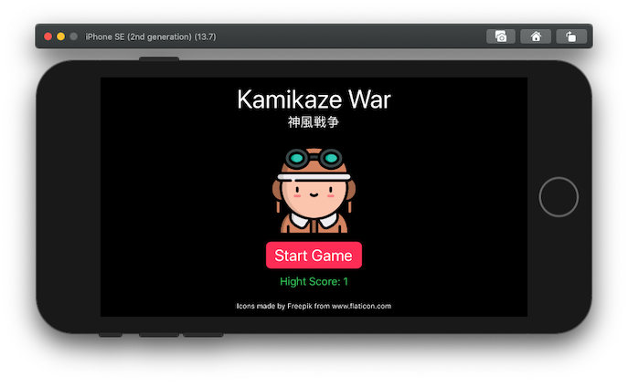

# 05 Superpoderes iOS

Realizar un juego en el que hay que disparar y derribar un avión antes de que llegue a su cámara partiendo de una posición aleatoria.

## Tecnologías

- Xcode
- Swift
  -- ARKit
  -- MVVM
  -- UserDefaults

## Especificaciones

- El avión contará con una barra de vida cuyo valor total es aleatorio.
- Hay dos tipos de munición, finita e infinita. La finita resta 2 puntos de vida y la infinita 1. Para obtener más munición finita hay que disparar a una caja de munición.
- El avión debe usar la técnica _billboard camera face_.
- Se almacenará un registro con la puntuación más alta obtenida de todas las partidas.

### Algunas mejoras sobre los objetivos solicitados

- El color de las balas y su velocidad dependen del tipo de munición.
- Se ha incorporado sonido para cada tipo de munición.
- La velocidad del avión se va incrementado progresivamente según aumentan el número de aviones destruidos (con un máximo para mantener la jugabilidad).
- Se ha creado una estructura Settings donde tener centralizado aquellos valores que pueden modificar el juego, de esta manera en un futuro se puede crear una pantalla de configuración.

##### Capturas de pantallas

